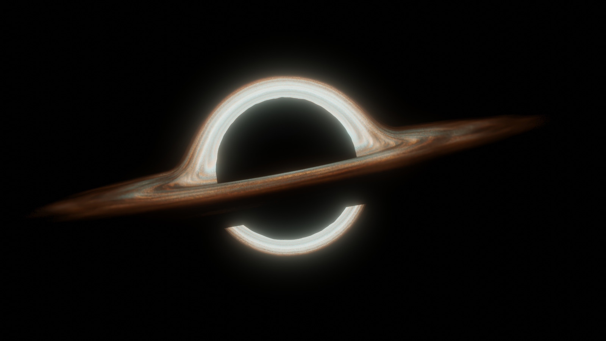

<!-- Template source: See: https://github.com/othneildrew/Best-README-Template -->
<a id="readme-top"></a>

[![Stargazers][stars-shield]][stars-url]
[![MIT License][license-shield]][license-url]
[![LinkedIn][linkedin-shield]](https://www.linkedin.com/in/arthur-testard/)


<!-- PROJECT LOGO -->
<br />
<div align="center">
  <a href="https://github.com/art-test-stack/stars_gui">
    
  </a>

<h3 align="center">STARS GUI</h3>

  <p align="center">
    This project has to purpose to create an animation of celestial bodies and they gravitational interactions, according to Newton's law and Euler's resolution.
    <br />
    <a href="https://github.com/art-test-stack/stars_gui"><strong>Explore the docs »</strong></a>
    <br />
    <br />
    <a href="https://github.com/art-test-stack/stars_gui/issues/new?labels=enhancement&template=feature-request---.md">Request Feature</a>
  </p>
</div>


<!-- TABLE OF CONTENTS -->
<details>
  <summary>Table of Contents</summary>
  <ol>
    <li>
      <a href="#about-the-project">About The Project</a>
      <ul>
        <li><a href="#the-implementation">The implementation</a></li>
        <li><a href="#built-with">Built With</a></li>
      </ul>
    </li>
    <li>
      <a href="#getting-started">Getting Started</a>
      <ul>
        <li><a href="#installation">Installation</a></li>
        <li><a href="#the-parameters">The Parameters</a></li>
        <li><a href="#the-equation">The Equations</a></li>
        <li><a href="#run-simulation">Run Simulation</a></li>
      </ul>
    </li>
    <li><a href="#usage">Usage</a></li>
    <li><a href="#roadmap">Roadmap</a></li>
    <li><a href="#contributing">Contributing</a></li>
    <li><a href="#license">License</a></li>
    <li><a href="#contact">Contact</a></li>
  </ol>
</details>


<!-- ABOUT THE PROJECT -->
## About The Project

### The Implementation

This project easily implement a resolution of Newton's gravitational law equation using Euler's method for a problem. For a defined number of celestial objects, the program compute the trajectory and provide a playful representation. The program also copute all the interactions between the different stars.


It can handles different objects called `CelestialBody` int the code, with different positions from the middle, velocity, masses etc... All of the details are bellow in [Parameters part](#the-parameters).

### Built With

* [![Numpy][Numpy]][Numpy-url]
* [![tkinter][Tkinter]][Tkinter-url]
<!-- * [![Sklearn][Sklearn]][Sklearn-url]
* [![Tqdm][Tqdm]][Tqdm-url] -->

<!-- <p align="right">(<a href="#readme-top">back to top</a>)</p> -->


<!-- GETTING STARTED -->
## Getting Started

### Installation

1. Clone the repo
   ```sh
   git clone git@github.com:art-test-stack/stars_gui.git
   ```
2. Create a virtual environment
    
    For example I use [virtualenv](https://virtualenv.pypa.io/en/latest/):
   ```sh
   virtualenv -p python 3.10 venv
   ```
3. Install pip packages
   ```sh
   pip install -r requirements.txt
   ```

<!-- <p align="right">(<a href="#readme-top">back to top</a>)</p> -->


### The Parameters:

The different basic parameters can be found on [`constants.py`](app/constants.py).

```python
from dataclasses import dataclass
from typing import List

@dataclass
class CelestialBodyBase:
    name: str 
    r_i : float
    v_i : List[float]
    mass: float
    color: str
```

- `name`: the name of the celestial body
- `r_i`: the distance to the middle of the canva (the biggest body is placed their). The angle is randomly set up on the circle defined by the middle and the radius.
- `v_i`: the absolute velocity of the celestial body
- `mass`: the mass of the celestial object
- `color`: the color of the celestial object

### The Equations:

According to Newton's law, for a set of $n$ celestial objects, we have the force applied to the $i$-th object given by:

$$F_i = - Gm_i \sum_{j=1, j\neq i}^n \frac{m_j}{r^2}\vec{u_{ji}}$$

where,
- $G$: is the universal gravitational constant
- $m_i$: is the mass of the $i$-th object
- $r$: is the distance between the two objects $j$ and $i$
- $\vec{u_ji}$: is the unitar vector from $j$ to $i$

Then for evey object $i$, we compute its acceleration at time $t$, which is simply:

$$a_i(t) = F_i(t) / m_i$$

Then, using Euler's resolution method, we have:

$$dv_i(t) = a_i(t) \cdot dt$$
$$dx_i(t) = dv_i(t) \cdot dt$$

Hence, we can compute the new velocity and the new position:

$$v_i(t) := v_i(t) + dv_i(t)$$
$$x_i(t) := x_i(t) + dx_i(t)$$

Notice that the computation have been made not considering the type of the referential. In the program, everything are compute in an euclidian one.

### Run The Animation:

Just run:

```bash
python main.py
```

## Usage

This framework permits to easily see how the different bodies in a set of celestial bodies, for example the solar system, they influence others and how they influence the others. So, anyone who want to see, for example, how the solar system runs, or any other set of celestial bodies does, can use it as a first step to see how a little piece of our universe can work !

However, it is only good as a first step, the equations used here are very basic, even if they handdle a big variety of situations.

<!-- <p align="right">(<a href="#readme-top">back to top</a>)</p> -->


<!-- ROADMAP -->
## Roadmap

- [ ] Make interactive GUI
- [ ] Select manually different options
- [ ] Live simulation
- [ ] Change equations
- [ ] Black Holes

<!-- See the [open issues](https://github.com/art-test-stack/stars_gui/issues) for a full list of proposed features (and known issues). -->

<!-- <p align="right">(<a href="#readme-top">back to top</a>)</p> -->


<!-- CONTRIBUTING -->
## Contributing

Contributions are what make the open source community such an amazing place to learn, inspire, and create. Any contributions you make are **greatly appreciated**.

If you have a suggestion that would make this better, please fork the repo and create a pull request. You can also simply open an issue with the tag "enhancement".
Don't forget to give the project a star! Thanks again!

1. Fork the Project
2. Create your Feature Branch (`git checkout -b feature/AmazingFeature`)
3. Commit your Changes (`git commit -m 'Add some AmazingFeature'`)
4. Push to the Branch (`git push origin feature/AmazingFeature`)
5. Open a Pull Request

<!-- <p align="right">(<a href="#readme-top">back to top</a>)</p> -->


<!-- LICENSE -->
## License

Distributed under the MIT License. See `LICENSE.txt` for more information.

<!-- <p align="right">(<a href="#readme-top">back to top</a>)</p> -->


<!-- CONTACT -->
## Contact

Arthur Testard - testardarthur@gmail.com

Project Link: [https://github.com/art-test-stack/stars_gui](https://github.com/art-test-stack/stars_gui)

<p align="right">(<a href="#readme-top">back to top</a>)</p>


<!-- MARKDOWN LINKS & IMAGES -->
[contributors-shield]: https://img.shields.io/github/contributors/art-test-stack/stars_gui.svg?style=for-the-badge
[contributors-url]: https://github.com/art-test-stack/stars_gui/graphs/contributors
[forks-shield]: https://img.shields.io/github/forks/art-test-stack/stars_gui.svg?style=for-the-badge
[forks-url]: https://github.com/art-test-stack/stars_gui/network/members
[stars-shield]: https://img.shields.io/github/stars/art-test-stack/stars_gui.svg?style=for-the-badge
[stars-url]: https://github.com/art-test-stack/stars_gui/stargazers
[issues-shield]: https://img.shields.io/github/issues/art-test-stack/stars_gui.svg?style=for-the-badge
[issues-url]: https://github.com/art-test-stack/stars_gui/issues
[license-shield]: https://img.shields.io/github/license/art-test-stack/stars_gui.svg?style=for-the-badge
[license-url]: https://github.com/art-test-stack/stars_gui/blob/master/LICENSE.txt
[linkedin-shield]: https://img.shields.io/badge/-LinkedIn-black.svg?style=for-the-badge&logo=linkedin&colorB=555
[linkedin-url]: https://linkedin.com/in/arthur-testard
[product-screenshot]: images/screenshot.png
[Numpy]: https://img.shields.io/badge/numpy-000000?style=for-the-badge&logo=nextdotjs&logoColor=white
[Numpy-url]: https://numpy.org/
[Tkinter]: https://img.shields.io/badge/tkinter-%23F7931E.svg?style=for-the-badge&logo=scikit-learn&logoColor=white
[Tkinter-url]: https://tkinter.org/stable/
<!-- [Matplotlib]: https://img.shields.io/badge/Matplotlib-20232A?style=for-the-badge&logo=react&logoColor=61DAFB
[Matplotlib-url]: https://matplotlib.org/
[Tqdm]: https://img.shields.io/badge/tqdm-35495E?style=for-the-badge
[Tqdm-url]: https://tqdm.github.io/ -->
